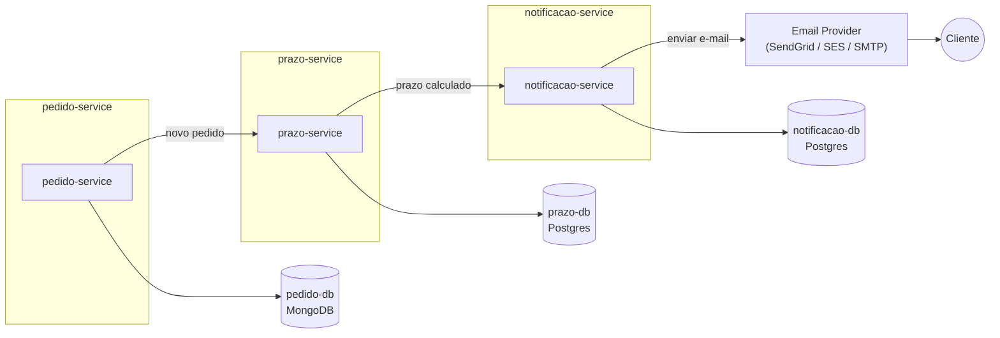

# Distributed Logistics System - Prazo Service

Objetivo

Simular um sistema distribuído de logística com microservices, filas e streaming de eventos, focando em resiliência e integração de bancos diferentes.

Tecnologias

Java 21+, Spring Boot 3+

Kafka ou RabbitMQ

MongoDB + PostgreSQL

Docker Compose

Testcontainers para testes automatizados

Arquitetura e Microservices

2️⃣ Cálculo de Prazo Service

Função: Recebe eventos de novos pedidos e calcula previsão de entrega.
Processamento:

Consumidor Kafka/RabbitMQ escuta eventos do Pedidos Service

Calcula tempo estimado baseado em origem/destino e itens

Publica evento de “prazo calculado” para Notificações Service

Banco: a definir (para armazenamento temporário de cálculos ou logs)

